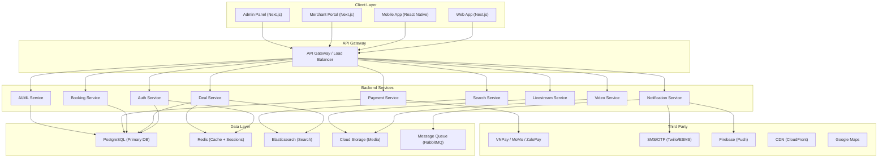
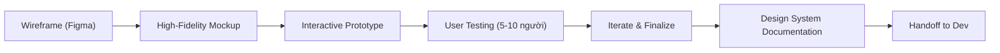
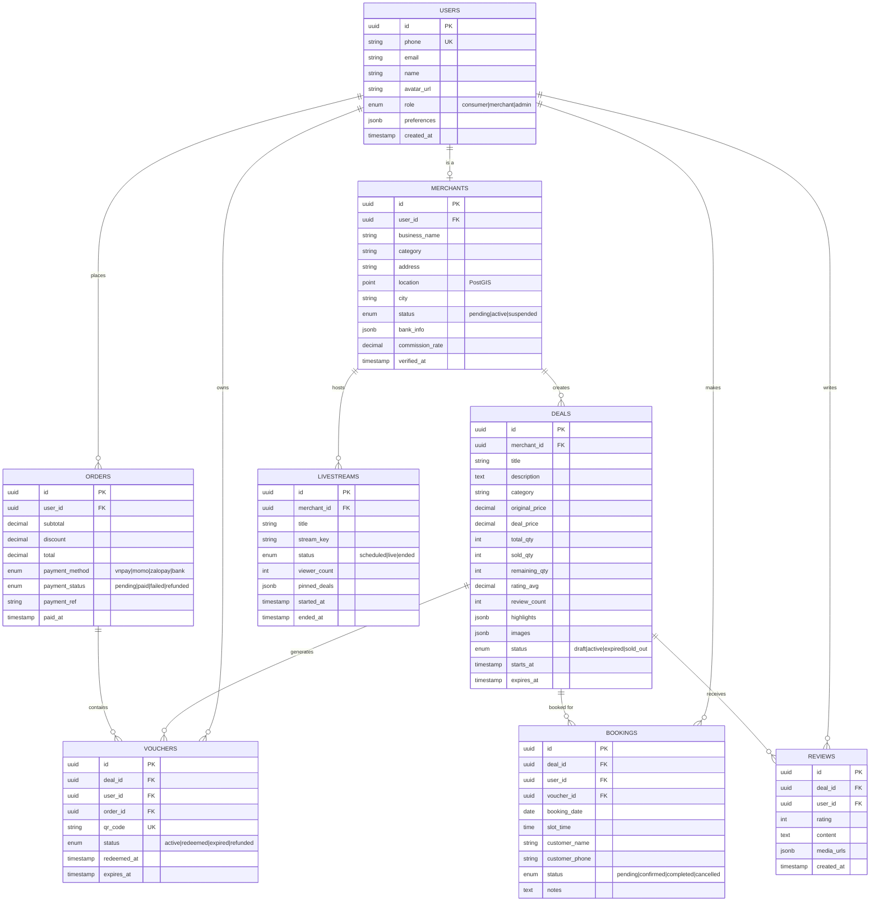
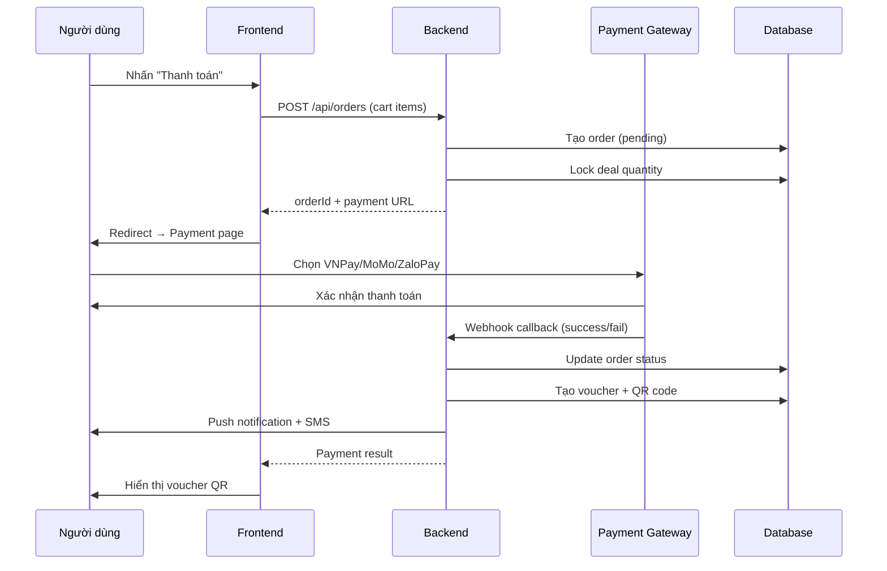
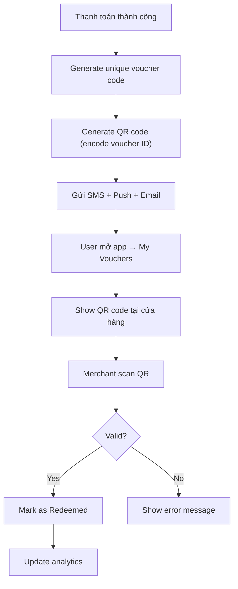
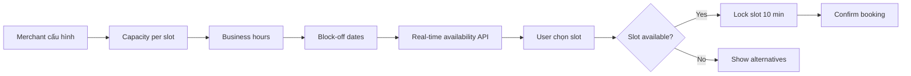
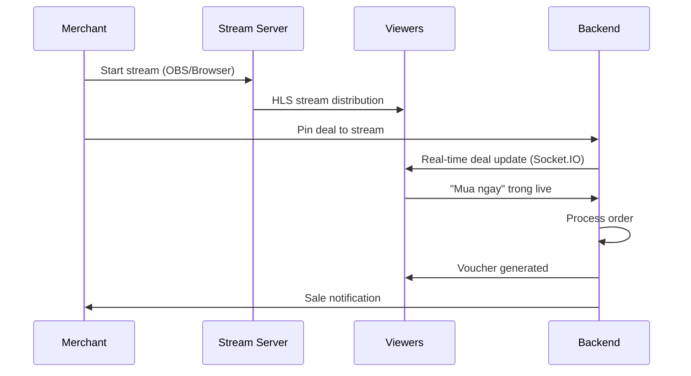
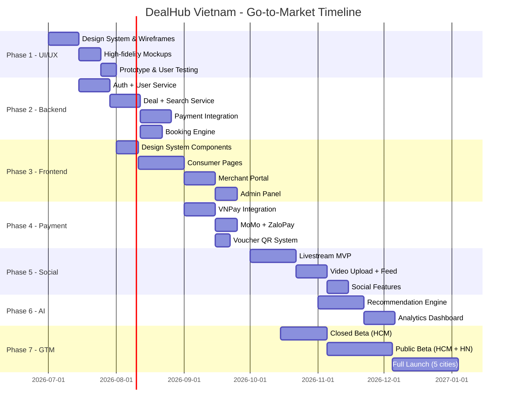
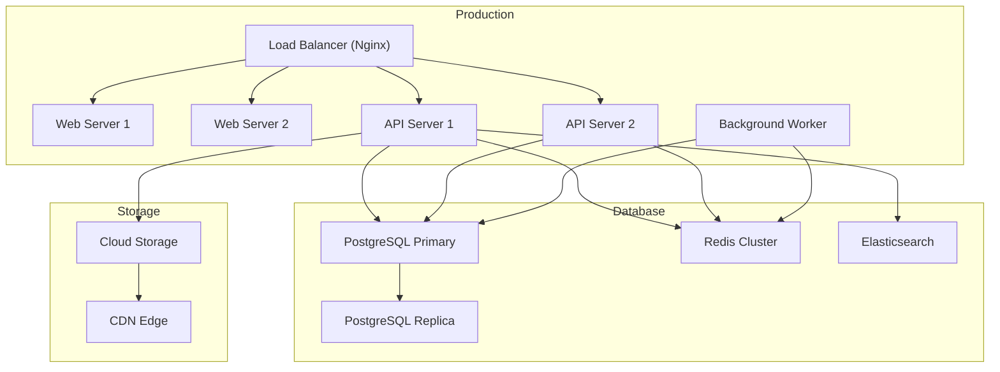

# 🚀 DealHub Vietnam — Kế Hoạch Thương Mại Hoàn Chỉnh

> **Từ Demo → Sản phẩm thương mại → Đưa ra thị trường**
> Ngày lập: 21/06/2026

---

## Tổng Quan Dự Án

**DealHub Vietnam** là nền tảng giao dịch địa phương kết hợp **Deal + Social + Video + Booking**, lấy cảm hứng từ Groupon + Foody + TikTok + Booking.com, tối ưu cho thị trường Việt Nam.

### Hiện Trạng (Demo)
Hiện tại có:
- [index.html](file:///d:/AntiGravity/teamlong/index.html) — Landing page tĩnh với 363 dòng HTML
- [styles.css](file:///d:/AntiGravity/teamlong/css/styles.css) — 1873 dòng CSS (mobile-first, responsive)
- [data.js](file:///d:/AntiGravity/teamlong/js/data.js) — Mock data (12 deals, 6 livestreams, 6 videos)
- [app.js](file:///d:/AntiGravity/teamlong/js/app.js) — Client-side logic (775 dòng, search, cart, booking, modal)

### Mục Tiêu Thương Mại
- **Marketplace 2 mặt**: Người dùng ↔ Doanh nghiệp
- **Mô hình doanh thu**: Hoa hồng 15-25% trên mỗi giao dịch + SaaS subscription cho đối tác
- **Thị trường mục tiêu**: 5 thành phố lớn Việt Nam (HCM, Hà Nội, Đà Nẵng, Nha Trang, Phú Quốc)

---

## UI/UX Mockups

### 1. Landing Page (Người dùng cuối)


### 2. Merchant Dashboard (Doanh nghiệp đối tác)


### 3. Mobile Deal Detail + Booking


### 4. Admin Panel (Quản trị hệ thống)


---

## Kiến Trúc Tổng Thể



---

## 🗺️ Roadmap 7 Phase

---

## PHASE 1: Thiết Kế UI/UX Hoàn Chỉnh
**Thời gian: 3-4 tuần | Ưu tiên: 🔴 Cao nhất**

### 1.1 Design System & Tokens

| Token | Giá trị | Mục đích |
|-------|---------|----------|
| `--c-primary` | `#e8482b` | Màu chủ đạo (CTA, badge, brand) |
| `--c-accent` | `#0aa772` | Tiết kiệm, thành công |
| `--c-surface` | `#ffffff` | White theme chủ đạo |
| `--c-bg` | `#f5f6f8` | Background xám nhẹ |
| Font | Be Vietnam Pro | Font chính tiếng Việt |
| Radius | 8/14/22px | Bo góc 3 cấp |

### 1.2 Các Màn Hình Cần Thiết Kế

#### Người dùng cuối (Consumer App — 15 màn hình)

| # | Màn hình | Mô tả | Trạng thái |
|---|----------|-------|------------|
| 1 | Landing/Home | Hero + categories + featured + live + nearby + video + recommend | ✅ Đã có demo |
| 2 | Deal Detail | Full info + gallery + review + booking + mua voucher | ✅ Đã có modal demo |
| 3 | Search & Filter | Full-text search + bộ lọc nâng cao (giá, khoảng cách, rating, category) | 🔲 Cần nâng cấp |
| 4 | Category Listing | Trang danh mục với infinite scroll + filter | 🔲 Mới |
| 5 | Cart & Checkout | Giỏ hàng + chọn phương thức thanh toán + xác nhận | ✅ Đã có modal demo |
| 6 | Booking Flow | Chọn ngày/giờ + form + xác nhận + QR code | ✅ Đã có modal demo |
| 7 | Auth (Đăng nhập/Đăng ký) | SMS OTP + Email + Google/Facebook | 🔲 Mới |
| 8 | User Profile | Thông tin cá nhân + voucher đã mua + lịch sử + yêu thích | 🔲 Mới |
| 9 | My Vouchers | Danh sách voucher đã mua + QR code + trạng thái | 🔲 Mới |
| 10 | Livestream Room | Video player + chat + deal pin + mua ngay | 🔲 Mới |
| 11 | Video Feed | Short-form video scroll (TikTok-style) + deal tag | 🔲 Mới |
| 12 | Notifications | Push + in-app + deal hết hạn reminder | 🔲 Mới |
| 13 | Map View | Bản đồ deal gần đây + filter | 🔲 Mới |
| 14 | Reviews & Ratings | Form đánh giá + gallery + video review | 🔲 Mới |
| 15 | Payment Result | Thanh toán thành công/thất bại + voucher QR | 🔲 Mới |

#### Merchant Portal (Dashboard — 10 màn hình)

| # | Màn hình | Mô tả |
|---|----------|-------|
| 1 | Dashboard Overview | Doanh thu, voucher bán, khách mới, tỷ lệ lấp đầy |
| 2 | Tạo Deal | Form tạo deal mới: tiêu đề, giá, số lượng, hạn, hình ảnh |
| 3 | Quản lý Deal | Danh sách deal đang chạy + thống kê từng deal |
| 4 | Booking Management | Lịch đặt chỗ + xác nhận/hủy + capacity |
| 5 | Livestream Studio | OBS/Browser streaming + chat + deal pin |
| 6 | Khách hàng | Danh sách khách + hành vi + AI gợi ý target |
| 7 | Báo cáo & Analytics | Doanh thu, lưu lượng, conversion, retention charts |
| 8 | Quảng cáo | Tạo chiến dịch quảng cáo + target audience |
| 9 | Đánh giá | Xem & trả lời đánh giá khách hàng |
| 10 | Cài đặt | Thông tin doanh nghiệp, giờ hoạt động, tài khoản ngân hàng |

#### Admin Panel (6 màn hình)

| # | Màn hình | Mô tả |
|---|----------|-------|
| 1 | System Overview | Tổng quan hệ thống: users, merchants, transactions, revenue |
| 2 | Merchant Management | Duyệt/từ chối đối tác + KYC verification |
| 3 | Deal Moderation | Kiểm duyệt deal trước khi lên sàn |
| 4 | Finance | Commission tracking, payout schedule, reconciliation |
| 5 | User Management | Quản lý user, báo cáo, ban/unban |
| 6 | System Config | Commission rates, city management, feature flags |

### 1.3 Workflow Thiết Kế



> [!IMPORTANT]
> **Quyết định cần User**: Sử dụng Figma hay code trực tiếp prototype? Team design hiện có bao nhiêu người?

---

## PHASE 2: Backend Architecture & API
**Thời gian: 6-8 tuần | Ưu tiên: 🔴 Cao nhất**

### 2.1 Tech Stack Backend

| Component | Technology | Lý do |
|-----------|-----------|-------|
| **Runtime** | Node.js 20 + TypeScript | Ecosystem lớn, team JS quen thuộc |
| **Framework** | NestJS | Enterprise-grade, modular, DI built-in |
| **Database** | PostgreSQL 16 | ACID, JSON support, full-text search |
| **ORM** | Prisma | Type-safe, migration, seeding |
| **Cache** | Redis 7 | Session, rate-limit, countdown cache |
| **Search** | Elasticsearch 8 | Full-text search + geo-location |
| **Queue** | BullMQ (Redis-based) | Background jobs, email, notification |
| **Storage** | AWS S3 / GCS | Image, video upload |
| **Auth** | JWT + Refresh Token + OTP | Stateless, scalable |

### 2.2 Database Schema (Core)



### 2.3 API Endpoints (Core)

```
# Auth
POST   /api/auth/send-otp          # Gửi OTP qua SMS
POST   /api/auth/verify-otp        # Xác thực OTP → JWT
POST   /api/auth/refresh            # Refresh token
POST   /api/auth/social/{provider}  # OAuth (Google/Facebook)

# Deals
GET    /api/deals                   # List deals (filter, sort, geo)
GET    /api/deals/:id               # Chi tiết deal
GET    /api/deals/featured          # Deal nổi bật
GET    /api/deals/nearby            # Deal gần tôi (geo query)
GET    /api/deals/categories        # Danh mục + count

# Cart & Orders
POST   /api/cart/add                # Thêm deal vào giỏ
GET    /api/cart                    # Lấy giỏ hàng
POST   /api/orders                  # Tạo đơn hàng
GET    /api/orders/:id              # Chi tiết đơn
POST   /api/orders/:id/pay          # Khởi tạo thanh toán
POST   /api/orders/:id/callback     # Payment webhook

# Bookings
POST   /api/bookings                # Đặt lịch
GET    /api/bookings/:id            # Chi tiết booking
GET    /api/deals/:id/slots         # Khung giờ available
PATCH  /api/bookings/:id/status     # Cập nhật trạng thái

# Vouchers
GET    /api/vouchers                # Voucher của tôi
GET    /api/vouchers/:id/qr         # QR code voucher
POST   /api/vouchers/:id/redeem     # Merchant scan → redeem

# Reviews
POST   /api/reviews                 # Viết đánh giá
GET    /api/deals/:id/reviews       # Đánh giá theo deal

# Livestream
GET    /api/livestreams             # Danh sách live
GET    /api/livestreams/:id         # Chi tiết live room
POST   /api/livestreams             # Merchant tạo live session

# Merchant
GET    /api/merchant/dashboard      # Dashboard overview
POST   /api/merchant/deals          # Tạo deal mới
GET    /api/merchant/analytics      # Báo cáo & analytics
GET    /api/merchant/customers      # Danh sách khách hàng

# Search
GET    /api/search?q=...&lat=...&lng=...  # Full-text + geo search

# Admin
GET    /api/admin/overview          # System stats
GET    /api/admin/merchants         # Merchant management
PATCH  /api/admin/merchants/:id     # Duyệt/từ chối merchant
GET    /api/admin/finance           # Finance overview
```

### 2.4 Workflow Thanh Toán



> [!WARNING]
> **Rủi ro**: Cần xử lý race condition khi nhiều user mua cùng deal còn ít quantity. Sử dụng **database-level locking** (SELECT FOR UPDATE) + **Redis distributed lock**.

---

## PHASE 3: Frontend Production (Next.js)
**Thời gian: 6-8 tuần | Ưu tiên: 🔴 Cao**

### 3.1 Tech Stack Frontend

| Component | Technology | Lý do |
|-----------|-----------|-------|
| **Framework** | Next.js 15 (App Router) | SSR, SEO, API routes |
| **Language** | TypeScript | Type safety |
| **State** | Zustand | Lightweight, simple |
| **Styling** | Vanilla CSS + CSS Modules | Theo user rules |
| **Forms** | React Hook Form + Zod | Validation mạnh |
| **Maps** | Leaflet / Google Maps | Deal gần tôi |
| **Real-time** | Socket.IO | Livestream chat, notifications |
| **Media** | HLS.js | Video streaming |

### 3.2 Cấu Trúc Dự Án Frontend

```
dealhub-web/
├── app/                          # Next.js App Router
│   ├── (auth)/
│   │   ├── login/page.tsx        # Đăng nhập
│   │   └── register/page.tsx     # Đăng ký
│   ├── (consumer)/
│   │   ├── page.tsx              # Landing / Home
│   │   ├── deals/
│   │   │   ├── [id]/page.tsx     # Deal detail
│   │   │   └── page.tsx          # Search & filter
│   │   ├── categories/
│   │   │   └── [slug]/page.tsx   # Category listing
│   │   ├── cart/page.tsx         # Giỏ hàng
│   │   ├── checkout/page.tsx     # Thanh toán
│   │   ├── live/
│   │   │   ├── [id]/page.tsx     # Live room
│   │   │   └── page.tsx          # All livestreams
│   │   ├── videos/page.tsx       # Video feed
│   │   ├── map/page.tsx          # Map view
│   │   └── profile/
│   │       ├── page.tsx          # User profile
│   │       ├── vouchers/page.tsx # My vouchers
│   │       └── bookings/page.tsx # My bookings
│   ├── (merchant)/
│   │   ├── dashboard/page.tsx    # Dashboard
│   │   ├── deals/
│   │   │   ├── new/page.tsx      # Tạo deal
│   │   │   └── page.tsx          # Quản lý deal
│   │   ├── bookings/page.tsx     # Quản lý booking
│   │   ├── livestream/page.tsx   # Livestream studio
│   │   ├── customers/page.tsx    # Khách hàng
│   │   ├── analytics/page.tsx    # Báo cáo
│   │   └── settings/page.tsx     # Cài đặt
│   └── (admin)/
│       ├── overview/page.tsx     # System overview
│       ├── merchants/page.tsx    # Merchant management
│       ├── moderation/page.tsx   # Content moderation
│       ├── finance/page.tsx      # Finance
│       └── config/page.tsx       # System config
├── components/
│   ├── ui/                       # Design system components
│   │   ├── Button.tsx
│   │   ├── Modal.tsx
│   │   ├── Toast.tsx
│   │   ├── Input.tsx
│   │   ├── Card.tsx
│   │   └── Badge.tsx
│   ├── deals/                    # Deal components
│   │   ├── DealCard.tsx
│   │   ├── DealDetail.tsx
│   │   ├── DealGrid.tsx
│   │   └── CountdownTimer.tsx
│   ├── live/                     # Livestream components
│   │   ├── LiveCard.tsx
│   │   ├── LiveRoom.tsx
│   │   └── ChatPanel.tsx
│   └── layout/                   # Layout components
│       ├── Header.tsx
│       ├── Footer.tsx
│       ├── MerchantSidebar.tsx
│       └── AdminSidebar.tsx
├── hooks/                        # Custom hooks
├── lib/                          # Utilities
├── services/                     # API client
├── stores/                       # Zustand stores
├── types/                        # TypeScript types
└── styles/                       # CSS Modules
```

### 3.3 Migration Plan: Demo → Production

Chuyển đổi từ demo hiện tại sang Next.js production:

```diff
- Static HTML (index.html)          → Next.js pages with SSR/SSG
- Inline mock data (data.js)        → API calls to backend
- Client-side search (app.js)       → Elasticsearch via API
- Modal-based UI                    → Full page routes + modals
- Emoji placeholders                → Real images (uploaded)
- localStorage cart                 → Server-side cart + auth
- No authentication                 → JWT + OTP auth flow
- No real payment                   → VNPay/MoMo/ZaloPay integration
- No real booking                   → Real-time slot management
```

---

## PHASE 4: Payment & Booking System
**Thời gian: 4-5 tuần | Ưu tiên: 🔴 Cao**

### 4.1 Tích Hợp Thanh Toán

| Gateway | Ưu tiên | Phí | Ghi chú |
|---------|---------|-----|---------|
| **VNPay** | 🥇 P0 | 1.1-1.5% | Phổ biến nhất VN |
| **MoMo** | 🥈 P1 | 0.8-1.2% | eWallet #1 VN |
| **ZaloPay** | 🥉 P2 | 0.8-1.0% | Ecosystem Zalo |
| **Bank Transfer** | P2 | 0% | Manual verify |

### 4.2 Voucher & QR System



### 4.3 Booking Availability Engine



---

## PHASE 5: Social + Video + Livestream
**Thời gian: 5-6 tuần | Ưu tiên: 🟡 Trung bình**

### 5.1 Livestream System

| Component | Technology |
|-----------|-----------|
| Streaming protocol | HLS / WebRTC |
| Media server | MediaSoup / LiveKit |
| Chat | Socket.IO + Redis Pub/Sub |
| Recording | FFmpeg + S3 |
| CDN | CloudFront / Cloudflare Stream |

**Workflow Livestream bán hàng:**



### 5.2 Video Review (Short-form)

- Upload: Giới hạn 60s, encode H.264/AAC
- Feed: Infinite scroll vertical (TikTok-style)
- Tag: Link video → deal → mua ngay
- CDN: Adaptive bitrate streaming

### 5.3 Social Features

- Follow doanh nghiệp
- Like/Share deal
- Comment & review (text + media)
- Referral program (chia sẻ deal → nhận credit)

---

## PHASE 6: AI & Analytics
**Thời gian: 4-5 tuần | Ưu tiên: 🟡 Trung bình**

### 6.1 AI-Powered Features

| Feature | Input | Output | Algorithm |
|---------|-------|--------|-----------|
| **Gợi ý deal** | Lịch sử mua, vị trí, thời gian | Top 20 deals phù hợp | Collaborative Filtering + Content-Based |
| **Dynamic Pricing** | Demand, time-to-expiry, capacity | Suggested deal price | Time-decay + demand curves |
| **Customer Matching** | User behavior, merchant profile | Potential customers cho merchant | Look-alike audience |
| **Fraud Detection** | Transaction patterns | Risk score | Anomaly detection |
| **Search Ranking** | Query, user profile, context | Ranked results | Learning-to-rank |

### 6.2 Analytics Dashboard

**Cho Merchant:**
- Doanh thu theo ngày/tuần/tháng
- Voucher sold vs redeemed rate
- Customer acquisition cost (CAC)
- Customer lifetime value (CLV)
- Fill rate (tỷ lệ lấp đầy công suất)
- Review sentiment analysis

**Cho Admin:**
- GMV (Gross Merchandise Value)
- Platform commission revenue
- Active merchants / users
- City-level performance
- Churn rate monitoring

---

## PHASE 7: Go-to-Market (GTM)
**Thời gian: 4 tuần chuẩn bị + ongoing | Ưu tiên: 🔴 Cao**

### 7.1 Launch Strategy



### 7.2 Chiến Lược Launch

#### Giai đoạn 1: Closed Beta (HCM — 50 merchants + 1000 users)
- Onboard 50 doanh nghiệp HCM (spa, nhà hàng, golf)
- Invite-only 1000 early adopters
- Free commission 3 tháng đầu
- Collect feedback, iterate

#### Giai đoạn 2: Public Beta (HCM + Hà Nội)
- Mở rộng lên 200+ merchants
- Marketing: Facebook Ads, Google Ads, KOL review
- Commission: 10% (introductory)
- Referral program: Giới thiệu bạn → nhận 50K credit

#### Giai đoạn 3: Full Launch (5 thành phố)
- HCM, Hà Nội, Đà Nẵng, Nha Trang, Phú Quốc
- Commission: 15-25% (theo category)
- SaaS subscription cho merchant premium features
- Partnership với payment gateways

### 7.3 Mô Hình Doanh Thu

| Nguồn | Tỷ lệ | Mô tả |
|-------|--------|-------|
| **Transaction Commission** | 15-25% | Hoa hồng mỗi voucher bán |
| **SaaS Subscription** | 500K-5M₫/tháng | Gói merchant premium |
| **Quảng cáo** | CPM/CPC | Promoted deals, banner ads |
| **Livestream Fee** | 5% | Commission từ sales qua live |
| **Data Insights** | Negotiated | Báo cáo ngành cho enterprise |

### 7.4 KPI Mục Tiêu (6 tháng đầu)

| Metric | Target |
|--------|--------|
| Active Merchants | 500+ |
| Monthly Active Users (MAU) | 50,000+ |
| Monthly GMV | 5 tỷ ₫+ |
| Platform Revenue | 750M ₫+ |
| Voucher Redemption Rate | >70% |
| Average Rating | >4.5 ★ |
| Merchant Retention (3 tháng) | >80% |

---

## Deployment & DevOps

### Infrastructure



### CI/CD Pipeline

| Stage | Tool | Action |
|-------|------|--------|
| Code | Git + GitHub | Branch strategy: main/develop/feature |
| Lint | ESLint + Prettier | Pre-commit hooks |
| Test | Jest + Playwright | Unit + E2E |
| Build | Docker | Multi-stage build |
| Deploy | GitHub Actions | Auto deploy to staging/prod |
| Monitor | Sentry + Grafana | Error tracking + metrics |

---

## Ước Tính Ngân Sách

### Team Cần Thiết

| Vai trò | Số lượng | Ghi chú |
|---------|----------|---------|
| Product Manager | 1 | Quản lý roadmap, priorities |
| UI/UX Designer | 1-2 | Figma, user research |
| Frontend Developer | 2-3 | Next.js, React Native |
| Backend Developer | 2-3 | NestJS, PostgreSQL |
| DevOps Engineer | 1 | CI/CD, infrastructure |
| QA/Tester | 1 | Manual + automated |
| **Tổng** | **8-12 người** | |

### Chi Phí Infrastructure (hàng tháng)

| Service | Cost/tháng | Ghi chú |
|---------|-----------|---------|
| Cloud Servers (VPS) | $200-500 | 2-4 servers |
| PostgreSQL (managed) | $50-100 | RDS hoặc managed |
| Redis (managed) | $30-50 | ElastiCache |
| Elasticsearch | $100-200 | Managed cluster |
| CDN | $50-100 | CloudFront |
| S3 Storage | $20-50 | Media files |
| SMS/OTP | $50-100 | Per message |
| Domain + SSL | $10-20 | |
| **Tổng** | **$510-1,120** | ~12-27M ₫/tháng |

---

## User Review Required

> [!IMPORTANT]
> ### Câu hỏi cần quyết định trước khi bắt đầu:
>
> 1. **Ưu tiên Phase nào trước?** Đề xuất: Phase 1 (UI/UX) + Phase 2 (Backend) + Phase 3 (Frontend) chạy song song → MVP trong 10-12 tuần
> 2. **Mobile App**: React Native đi kèm hay chỉ Web responsive trước?
> 3. **Hosting**: AWS, GCP, hay VPS Việt Nam (Viettel Cloud, FPT Cloud)?
> 4. **Payment Gateway**: Ưu tiên VNPay trước hay tích hợp nhiều cổng cùng lúc?
> 5. **Team size**: Có sẵn team hay cần tuyển? Agent AntiGravity code toàn bộ?
> 6. **Budget**: Ngân sách ước tính cho 6 tháng đầu?
> 7. **MVP scope**: Chấp nhận launch MVP không có Livestream + AI trước?

## Open Questions

> [!WARNING]
> ### Rủi ro cần lưu ý:
>
> - **Pháp lý**: Cần đăng ký kinh doanh thương mại điện tử theo Nghị định 52/2013/NĐ-CP
> - **Bảo mật**: PCI DSS compliance cho thanh toán, PDPA cho dữ liệu cá nhân
> - **Cạnh tranh**: Groupon VN đã thoái lui, nhưng Foody (ShopeeFood), Klook, Traveloka là đối thủ mạnh
> - **Chicken-and-egg**: Cần có deal để thu hút user, cần có user để thu hút merchant

---

## Verification Plan

### Automated Tests
```bash
# Unit tests
npm test

# E2E tests  
npx playwright test

# API tests
npm run test:api

# Load testing
npx k6 run load-test.js
```

### Manual Verification
- User testing với 5-10 người thật cho từng flow
- Merchant onboarding pilot với 3-5 doanh nghiệp
- Payment sandbox testing trước khi live
- Security audit trước khi launch
